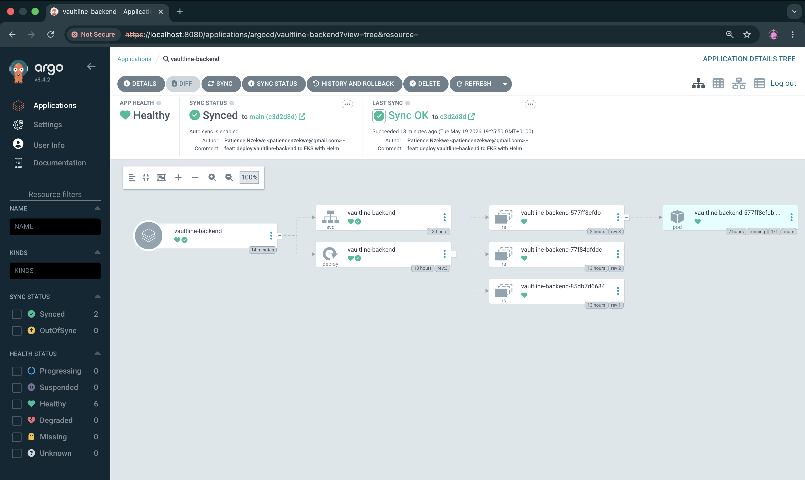
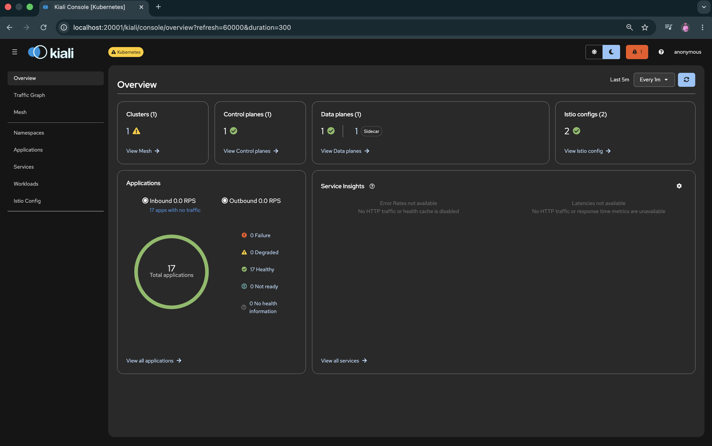

# Vaultline

Production-grade banking platform on AWS EKS implementing
enterprise DevOps and Platform Engineering practices.

## Overview

Vaultline is a cloud-native banking platform providing
account management, transaction processing, and fund
transfer capabilities. The platform is built on a secure,
observable, and highly available Kubernetes architecture
with full GitOps delivery and an automated DevSecOps
pipeline.

Users can register accounts, view balances across current
and savings accounts, transfer funds between accounts with
real-time balance updates, and view complete transaction
history with reference numbers.

## Application Architecture

The platform follows a microservices architecture with
five core components. The React TypeScript frontend
delivers the banking dashboard to users. The API Gateway
built on Node.js Express handles request routing and
authentication. Three backend services handle account
management, transaction processing, and customer
notifications independently, allowing each to scale
and deploy separately.

## Infrastructure

The platform runs on AWS EKS with Istio service mesh
enforcing mutual TLS between all services. PostgreSQL
on RDS Multi-AZ handles transactional data with automatic
failover. ElastiCache Redis manages session state.
HashiCorp Vault handles all secret management with dynamic
credential generation and automatic rotation. Amazon ECR
stores all container images.

## Delivery Pipeline

Infrastructure is provisioned via Terraform across three
environments. ArgoCD implements GitOps continuous delivery,
reconciling the cluster state against the Git repository
on every commit. GitHub Actions runs the CI/CD pipeline
using OIDC federation to AWS, eliminating static credentials
entirely. Helm charts package all Kubernetes workloads.

## Security Controls

The platform implements defence-in-depth security across
multiple layers. Istio enforces zero-trust networking with
mutual TLS between all services. All data stores use
encryption at rest. Checkov scans Terraform for
misconfigurations before any infrastructure change is
applied. Trivy scans every Docker image for vulnerabilities
before it reaches the container registry. Falco monitors
runtime behaviour for anomalous activity. CloudTrail and
Vault audit logs provide a complete tamper-evident record
of all operations.

## Observability

Prometheus collects metrics from all cluster workloads.
Grafana provides dashboards covering transaction success
rates, API latency, infrastructure cost, and security
events. The ELK Stack aggregates logs from all services
into a centralised searchable store. OpenTelemetry provides
distributed tracing across the microservices.

## Multi-Environment Strategy

The platform uses three environments managed by Terraform.
Development runs locally on Docker Compose with no AWS
costs. Staging uses a reduced AWS configuration for
integration testing. Production uses the full AWS
configuration with Multi-AZ redundancy.

## CI/CD Pipeline

Every commit to the main branch triggers the following
automated pipeline. No manual steps are required for
deployment.

```
Code Push → Terraform Validate → Checkov Scan
         → Unit Tests → Docker Image Build
         → Trivy Scan → Push to ECR
         → ArgoCD Sync → Health Verification
         → Deployment Complete
```

Authentication to AWS uses OIDC federation. No static
AWS credentials are stored in the pipeline at any point.

## AWS Services

```
Compute:    EKS, EC2
Database:   RDS PostgreSQL, ElastiCache Redis
Networking: ALB, Route53, NAT Gateway, VPC
Security:   IAM, GuardDuty, WAF, CloudTrail,
            Security Hub, KMS, Secrets Manager
Storage:    S3, ECR 
Monitoring: CloudWatch
```

## Infrastructure Status

```
VPC:     Live — eu-west-2 London — 10.0.0.0/16
ECR:     Live — vaultline-backend repository
EKS:     Live — vaultline-cluster — Kubernetes 1.33 — 2 nodes Ready
K8s:     Live — vaultline-backend deployed — vaultline namespace — 0 restarts
ArgoCD:  Live — GitOps sync enabled — Healthy and Synced
Ingress: Live — F5 NGINX Ingress Controller 5.4.2 — NLB
TLS:     Live — Let's Encrypt production certificate — api.vaultline.uk
DNS:     Live — ExternalDNS managing Route53 — vaultline.uk
Vault:   Live — Vault 1.20.4 — dynamic database credentials enabled
Istio:   Live — Istio 1.30.0 — strict mTLS enforced — Kiali running
RDS:     Live — PostgreSQL 17.4 — Multi-AZ
```

Live API: https://api.vaultline.uk/api/health

## Local Development

```bash
git clone git@github.com:patiencenzekwe/vaultline.git
cd vaultline
cp backend/.env.example backend/.env
docker compose -f docker-compose.dev.yml up -d
cd backend && npm install && npm run dev
```

API available at http://localhost:3001/api/health

## Running Tests

```bash
cd backend
npm test
```

20 tests across four suites. 77% line coverage. Coverage
gate enforced at 70%.

## Documentation

- [Architecture Decisions](docs/architecture-decisions.md)
  Technology choices and the reasoning behind each decision

- [API Reference](docs/api.md)
  Complete endpoint documentation with request and response formats

- [Docker Architecture](docs/docker.md)
  Container strategy, security controls, and build process

- [Testing Strategy](docs/testing.md)
  Test suite structure, coverage requirements, and design principles

- [Infrastructure](docs/infrastructure.md)
  AWS resources, Terraform structure, and provisioning commands

## Screenshots

**ArgoCD — GitOps deployment synced and healthy**


**Kiali — Service mesh with mutual TLS enforced**


## Status

Active Development

---

**Patience Nzekwe** — DevOps Engineer  
[GitHub](https://github.com/patiencenzekwe) · [LinkedIn](https://linkedin.com/in/patiencenzekwe)